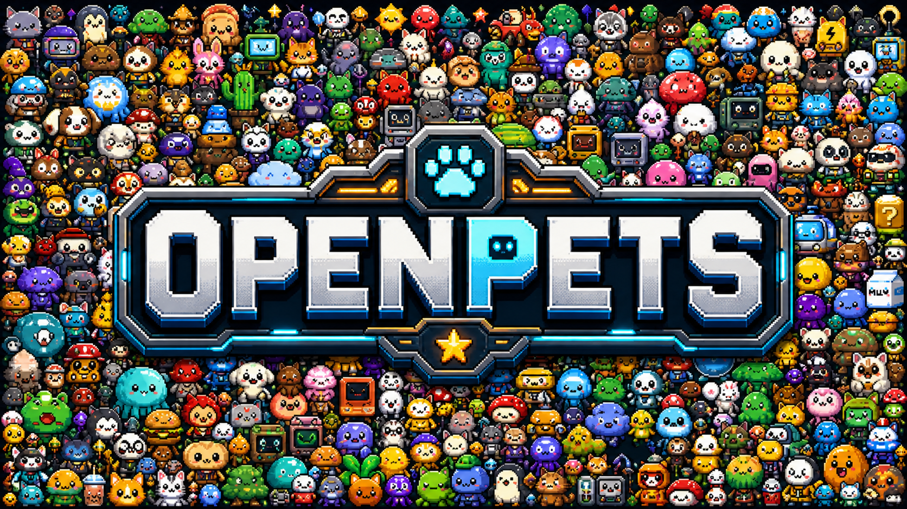

<p align="center">
  
</p>

<p align="center">
  <strong>Uma plataforma de acompanhantes de desktop com pets, plugins e integrações opcionais com agentes locais.</strong>
</p>

<p align="center">
  O OpenPets coloca um acompanhante animado na sua área de trabalho e permite que plugins o transformem em um parceiro de foco, sistema de lembretes, mini-jogo, inicializador ou um parceiro agente de programação (coding-agent sidekick).
</p>

<p align="center">
  
</p>

<div align="center">
  <p><sub>por <b>Boring Dystopia Development</b></sub></p>
  <p>
    <a href="https://boringdystopia.ai/"></a>&nbsp;
    <a href="https://x.com/alvinunreal"></a>&nbsp;
    <a href="https://t.me/boringdystopiadevelopment"></a>&nbsp;
  </p>
</div>

<p align="center">
  Leia em: <a href="README.md">English</a> | <a href="README.ja.md">日本語</a> | <a href="README.ko.md">한국어</a> | <a href="README.zh-Hans.md">简体中文</a> | <a href="README.zh-Hant.md">繁體中文</a> | <a href="README.pt-BR.md">Português (Brasil)</a> | <a href="README.es-419.md">Español (LatAm)</a>
</p>

---

## Baixar o OpenPets

**[Baixe a versão mais recente do OpenPets para desktop](https://github.com/alvinunreal/openpets/releases/latest)** e execute-o. Um pet aparecerá imediatamente; nenhuma configuração de agente é necessária.

- **Pets de desktop**: acompanhantes animados que ficam ociosos, andam pela tela, reagem e evitam que seu espaço de trabalho pareça vazio.
- **Plugins oficiais**: temporizadores de foco, lembretes, acompanhamento de humor, mini-jogos, atalhos de inicialização, alertas de hidratação e atributos de pet virtual.
- **Plugin SDK v3**: um ambiente de execução (runtime) JavaScript/TypeScript sandbox para criar novas habilidades para os pets com permissões, cotas, armazenamento, agendamentos, comandos, painéis, eventos, áudio, notificações e muito mais.
- **Camada de agente opcional**: clientes Claude Code, OpenCode, Cursor, Pi e MCP podem acionar reações locais do pet sem expor prompts, códigos, caminhos, logs ou segredos em balões de fala.

---

## Dê uma Estrela ao OpenPets

Se o OpenPets tornar sua configuração de programação ou área de trabalho de desktop um pouco mais divertida, por favor, dê uma estrela ao repositório.

<p align="center">
  
</p>

---

## Para Usuários: Primeiros Passos

Você não precisa ser desenvolvedor ou conectar nenhum agente de IA para aproveitar o OpenPets. O aplicativo de desktop é totalmente funcional pronto para uso com a linha de plugins oficiais.

### 1. Instalar o OpenPets Desktop

Baixe o pacote para o seu sistema operacional a partir das [Versões do OpenPets](https://github.com/alvinunreal/openpets/releases/latest):

- **macOS Apple Silicon**: `OpenPets-*-mac-arm64.dmg`
- **macOS Intel**: `OpenPets-*-mac-x64.dmg`
- **Windows**: `OpenPets-*-win-x64-setup.exe`
- **Linux**: `OpenPets-*-linux-x86_64.AppImage`

> Nota: As compilações atuais podem não estar assinadas. Se o macOS bloquear a execução com um aviso de segurança, remova a flag de quarentena via terminal:
> ```bash
> xattr -dr com.apple.quarantine /Applications/OpenPets.app
> ```

### 2. Gerenciar e Personalizar Pets

Navegue pelos pets instalados, pré-visualize seus quadros de animação e configure qual pet monitora cada espaço de trabalho ou janela de agente a partir da **Galeria de Pets** integrada.

<p align="center">
  
</p>

### 3. Habilitar Plugins Oficiais

O OpenPets v3 vem com um **Catálogo de Plugins Oficiais** modular. Habilite ou configure plugins através da Central de Controle (Control Center) do desktop para adicionar temporizadores de foco, lembretes e mini-jogos interativos.

#### Linha oficial inclusa

- **Day Routine**: Acompanha hábitos e lembra você de se alongar ou fazer uma pausa.
- **Focus Buddy**: Temporizadores de foco no estilo Pomodoro para gerenciar ciclos de trabalho.
- **Fortune Cookie**: Abre conselhos e sabedorias diárias aleatórias.
- **Launch Buddy**: Permite registrar comandos de atalho para abrir rapidamente pastas locais, projetos ou aplicativos.
- **Magic 8 Ball**: Faça perguntas e receba respostas divertidas e aleatórias do seu pet.
- **Mood Check-in**: Verifica periodicamente o seu humor para apoiar o bem-estar emocional.
- **Reminders**: Renderiza notificações de alerta sonoro com soneca e tons de áudio personalizados.
- **Virtual Pet**: Transforma seu acompanhante de desktop em um pet estilo Tamagotchi com níveis de fome, afeto e energia acompanhados por um pin de status em tempo real.
- **Water Reminder**: Mantém você hidratado com lembretes de consumo de água regulares e personalizáveis.

---

## Plataforma de Plugins & SDK v3

O sistema de plugins do OpenPets oferece um SDK seguro e amigável para desenvolvedores (`@open-pets/plugin-sdk`) para criar comportamentos personalizados para o acompanhante.

### Segurança & Arquitetura
- **Ambiente de Execução Sandbox (Sandboxed Runtime)**: Cada plugin JS é executado dentro de um ambiente hospedeiro BrowserWindow isolado (sandboxed).
- **Interface Renderizada pelo Hospedeiro (Host-Rendered UI)**: Os plugins descrevem ações, HUDs e notificações; o hospedeiro desktop os renderiza. O código HTML/JS não pode renderizar HTML bruto ou executar scripts arbitrários dentro de uma janela de pet.
- **Modelo de Permissões**: As permissões devem ser declaradas no manifesto e aprovadas pelo usuário na instalação. APIs sensíveis sinalizadas (como `voice:listen`, `clipboard` e `pet:speak:dynamic`) exigem confirmações explícitas de consentimento.
- **Proteções contra SSRF & Hospedeiro Privado**: As requisições de busca de rede (fetch) são limitadas a nomes de domínio declarados pelo desenvolvedor e protegidas contra SSRF local.

### A interface do SDK (`ctx`)
Os plugins se conectam ao ambiente desktop através do objeto `ctx`, expondo:
- `ctx.pets` / `ctx.pet`: Gerencia instâncias padrão e geradas (spawned) de pets: gerar (spawn), mover, animar e reagir.
- `ctx.ui`: Alertas, balões temporários/fixados, menus personalizados, painéis e HUDs de status. Balões de mini HUD fixados oferecem suporte a layouts compactos em grade 2x2 com barras de progresso, como as estatísticas do Virtual Pet.
- `ctx.audio`: Aciona tons de alerta gerenciados pelo hospedeiro ou áudios personalizados importados pelo usuário.
- `ctx.schedule`: Define ganchos de temporizador precisos (`once`, `every`, `daily`, `cron`, `at`).
- `ctx.ai` / `ctx.secrets`: Conecta-se ao provedor de IA configurado pelo usuário no hospedeiro (Anthropic, OpenAI, Ollama) sem expor chaves de API ao código-fonte do plugin.
- `ctx.storage`: Armazenamento simples de chave-valor JSON com inscrições de alterações.
- Outras APIs: `events`, `assets`, `bus`, `net` (com suporte a streaming), `notify`, `voice` (TTS & STT push-to-talk), `auth` (fluxo de navegador PKCE), `files` (diálogos seguros do SO para seleção de arquivos), `system`, `commands`, `status` e `log`.

### Ferramentas de Desenvolvimento & Comandos

Crie, valide e teste plugins usando a CLI oficial.

#### 1. Gerar a estrutura de um novo plugin
Crie um modelo a partir de qualquer um dos layouts oficiais (`blank`, `reminder`, `ambient`, `ai-chat`, `tamagotchi`, `calendar`):
```bash
npx @open-pets/cli plugin new "My Plugin" --template tamagotchi
```

#### 2. Validar
Verifique o layout do manifesto, permissões e esquemas de configuração antes de empacotar:
```bash
npx @open-pets/cli plugin validate ./my-plugin
```

#### 3. Suíte de Testes (Test Harness)
Escreva testes determinísticos sem iniciar o aplicativo desktop. Usando o `createTestHarness` do `@open-pets/plugin-sdk/testing`, você pode simular (mock) o hospedeiro, avançar relógios, acionar ações e verificar reações:
```javascript
import { createTestHarness } from "@open-pets/plugin-sdk/testing";
import { register } from "./index.js";

const h = createTestHarness(register, { permissions: ["pet:speak", "schedule"] });
await h.start();
h.expectScheduled("decay");
await h.clock.advance("30m");
h.expectSpoke(/need attention/i);
```
Execute os testes do plugin a partir do projeto do seu plugin:
```bash
npm test
```

---

## Avançado: Integrações com Agentes

Se você deseja que seu agente de desenvolvimento controle seu acompanhante de desktop, o OpenPets fornece uma camada opcional de integração MCP (Model Context Protocol) local.

<p align="center">
  
</p>

### Como funciona
Ao configurar um agente, o OpenPets expõe ferramentas MCP padrão. O agente pode acionar animações, alterar o status e exibir balões de texto localmente:
1. **Claude Code**: Instala o OpenPets MCP, instruções de memória em `~/.claude/CLAUDE.md` e ganchos (hooks) em `~/.claude/settings.json`.
2. **OpenCode**: Instala o OpenPets MCP, arquivos de instrução de projeto personalizados e o plugin de gancho automático `@open-pets/opencode`.
3. **Cursor / Outros Clientes MCP**: Registre o OpenPets como um servidor MCP padrão via stdio ou TCP.

<p align="center">
  
</p>

### Configuração do Servidor MCP
Para executar o OpenPets como uma ferramenta MCP, adicione o servidor à configuração do seu agente:
```json
{
  "mcpServers": {
    "openpets": {
      "type": "stdio",
      "command": "npx",
      "args": ["-y", "@open-pets/mcp@latest"]
    }
  }
}
```
*Dica: Para direcionar a um pet específico, passe o argumento `--pet <petId>` .*

### Ferramentas MCP Disponíveis
- `openpets_status`: Recupera o ID do pet alvo e verifica a conectividade em tempo de execução.
- `openpets_react`: Define animações de reação do pet (por exemplo, `thinking`, `editing`, `testing`, `success`, `error`).
- `openpets_say`: Exibe um pequeno balão de fala.

### Privacidade & Segurança Local
- Todas as reações automatizadas são executadas com base em gatilhos locais estáticos (por exemplo, quando um comando é executado ou um arquivo é gravado).
- O conteúdo da fala é validado para evitar o vazamento de variáveis confidenciais, caminhos, segredos ou trechos de código multilinha.
- A interação em tempo real requer a escrita/leitura de um token de descoberta local, protegendo a ponte IPC contra gatilhos de redes externas.

---

## Workspace de Desenvolvimento

Para contribuir com a base de código do OpenPets, testar alterações ou compilar os pacotes de desktop localmente.

### Pré-requisitos
- **Node.js**: versão 20 ou superior
- **pnpm**: versão 11 ou superior
- **TypeScript**: suporte ao compilador

### Comandos

Instalar as dependências do workspace do projeto:
```bash
pnpm install
```

Iniciar o aplicativo Electron em modo de desenvolvedor local:
```bash
pnpm dev:desktop
```

Iniciar com os plugins oficiais ativos carregados e monitorados:
```bash
pnpm dev:desktop:plugins
```

Executar a checagem de tipos, validações de conformidade de código e testes no workspace:
```bash
pnpm check
pnpm typecheck
pnpm test
```

Empacotar o aplicativo de desktop:
```bash
# Compilar e empacotar no diretório de destino do SO
pnpm package:desktop:dir

# Compilar e empacotar nos instaladores / arquivos de configuração finais
pnpm package:desktop
```

### Estrutura do Workspace
```text
apps/desktop              Aplicativo desktop Electron
packages/client           @open-pets/client (biblioteca auxiliar de IPC)
packages/mcp              @open-pets/mcp (servidor stdio de Model Context Protocol)
packages/claude           @open-pets/claude (integrações do Claude, memória e ganchos)
packages/opencode         @open-pets/opencode (plugins e configurações de instrução do OpenCode)
packages/pi               @open-pets/pi (integração de extensão CLI do Pi)
packages/agent-events     Pacote auxiliar compartilhado de sanitizadores e eventos
packages/cli              @open-pets/cli (CLI de ponto de entrada do usuário para configuração e scaffolding)
packages/sdk              @open-pets/sdk (declarações e suíte de testes do Plugin SDK v3)
packages/pet-format       @open-pets/pet-format (tipos de esquema e manifesto de pet)
plugins/official          Workspace de plugins oficiais integrados (empacotados com o catálogo hospedeiro)
docs/                     Especificações técnicas e documentação de arquitetura
```

---

## Documentação

Explore a documentação detalhada de arquitetura e plataforma dentro da pasta `docs/`:
- [`docs/plugins.md`](docs/plugins.md) - SDK da plataforma de plugins v3, manifesto, permissões e kit de testes.
- [`docs/claude-integration.md`](docs/claude-integration.md) - Integração com Claude Code (memória, ganchos, MCP).
- [`docs/opencode.md`](docs/opencode.md) - Integração com workspaces do OpenCode.
- [`docs/wsl-ipc.md`](docs/wsl-ipc.md) - Configuração da ponte TCP de WSL para Windows.
- [`docs/testing.md`](docs/testing.md) - Estratégia de testes e conformidade do workspace.
- [`docs/release.md`](docs/release.md) - Processos de empacotamento e lançamento do aplicativo.
- [`docs/workflow.md`](docs/workflow.md) - Fluxo de trabalho de desenvolvimento principal e contribuições.

---

## Segurança e Privacidade

- **Apenas Local (Local-Only)**: O IPC do OpenPets funciona usando um socket local/named pipe, protegido com um token de segurança aleatório por execução.
- **Segurança contra SSRF**: As conexões de rede de plugins são restritas a domínios aprovados e bloqueadas para acesso à rede local ou IPs privados.
- **Sanitização de Conteúdo Dinâmico**: Qualquer texto de fala dinâmico gerado por IA passa por filtros locais rigorosos para ocultar caminhos, URLs, segredos ou trechos de código multilinha.
- **Consentimento de Permissões Sensíveis**: Recursos que acessam a área de transferência (clipboard), microfone ou respostas dinâmicas de IA vêm desativados por padrão e exigem o consentimento explícito do usuário.
